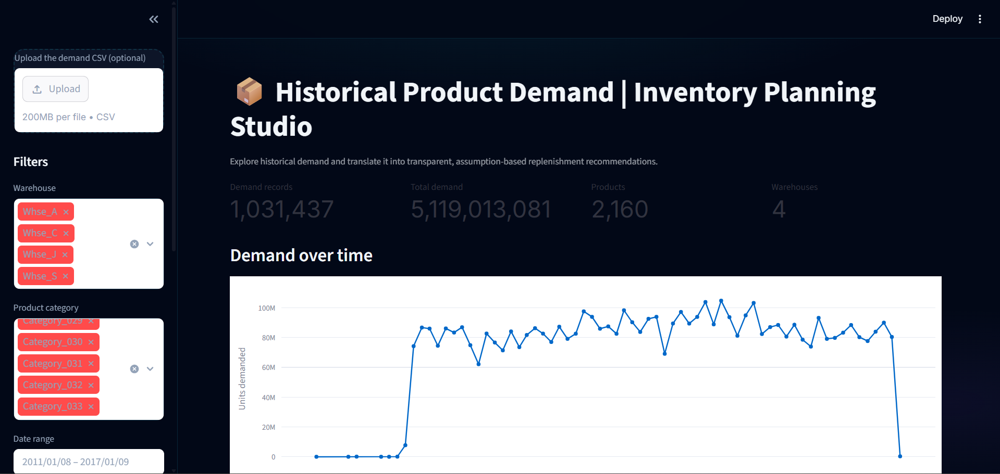
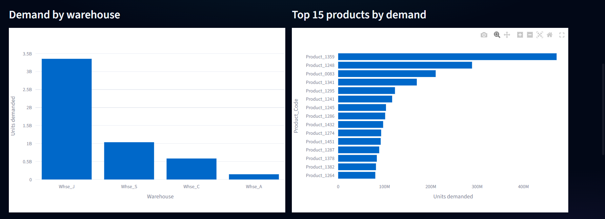
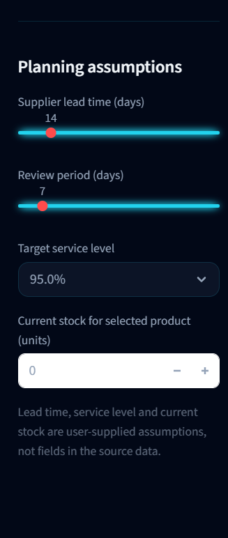
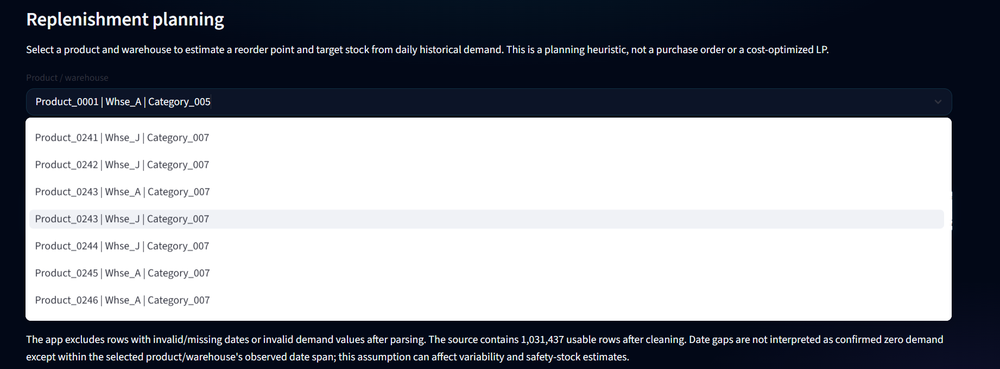
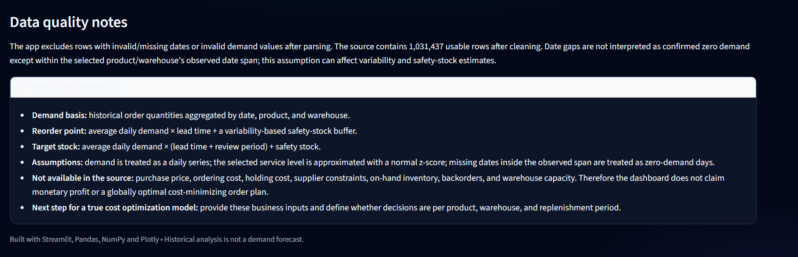
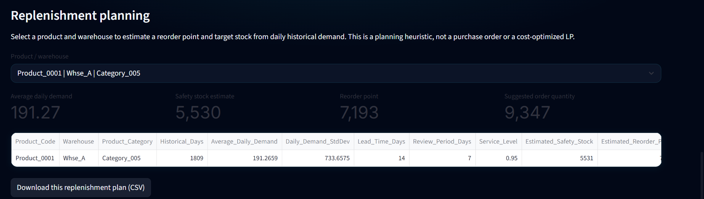
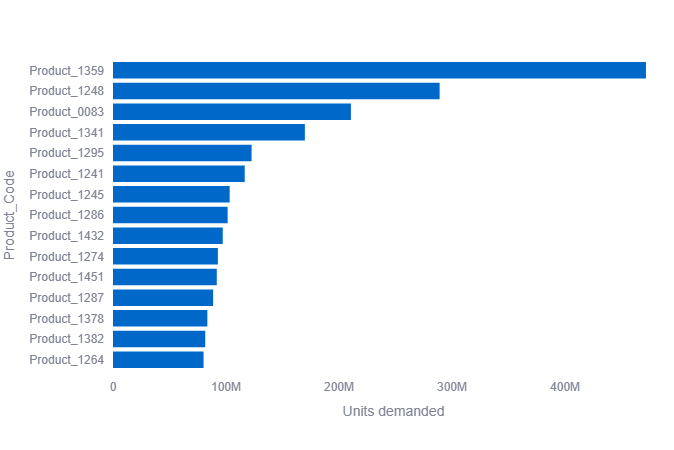
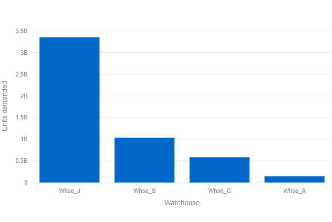
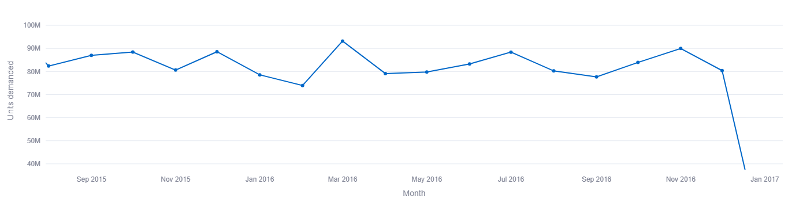

# Historical Product Demand — Inventory Planning Studio


An interactive product-demand analytics project that explores historical order demand across products, warehouses, categories, and time. The dashboard turns historical demand patterns into transparent, assumption-based inventory replenishment estimates.

The project includes data cleaning, exploratory demand analysis, interactive Plotly visualizations, an inventory-planning workflow, and downloadable replenishment recommendations.

> **Project scope:** This is a historical demand analysis and inventory-planning tool. It is not a demand-forecasting model or a cost-optimized purchasing system.

## Project Highlights

- Data validation and cleaning for historical product-demand records
- Interactive analysis by warehouse, product category, and date range
- KPI summaries for demand records, total demand, products, and warehouses
- Monthly demand trends and warehouse-level demand comparisons
- Identification of the top 15 products by historical demand
- Inventory planning estimates for average daily demand, safety stock, reorder point, target stock, and suggested order quantity
- User-configurable lead time, review period, service level, and current stock
- Downloadable replenishment plan in CSV format
- Dashboard notes describing methodology, assumptions, and limitations

## Dataset

The project uses `Historical Product Demand.csv`.

The dataset contains the following fields:

| Column | Description |
|---|---|
| `Product_Code` | Product identifier |
| `Warehouse` | Warehouse identifier |
| `Product_Category` | Product category |
| `Date` | Date of the demand record |
| `Order_Demand` | Recorded order demand |

The application parses dates and demand values, then excludes records with missing or invalid required fields and negative demand values. The source data includes missing or invalid dates, so the number of usable records may be lower than the original row count.

## Tech Stack

- Python
- Pandas and NumPy
- Plotly
- Streamlit
- CSV

## Project Structure

```text
historical-product-demand-analytics/
├── app.py
├── data/
│   └──Historical Product Demand.csv
├── assets/
│   └──01.png
│   └──02.png
│   └──03.png
│   └──04.png
│   └──05.png
│   └──06.png
│   └──07.png
│   └──08.png
│   └──09.png
├── requirements.txt
└── README.md
```

## Installation

Clone or download the repository, then open a terminal in the project directory.

```bash
git clone https://github.com/YOUR-USERNAME/YOUR-REPOSITORY.git
cd historical-product-demand-analytics
python -m venv .venv
```

Activate the virtual environment:

**Windows (Command Prompt):**
```bash
.venv\Scripts\activate
```

**Windows (Git Bash):**
```bash
source .venv/Scripts/activate
```

**macOS/Linux:**
```bash
source .venv/bin/activate
```

Install the required packages:

```bash
pip install -r requirements.txt
```

## Run the Dashboard

```bash
streamlit run app.py
```

The dashboard should open in your browser. Keep `Historical Product Demand.csv` in the same folder as `app.py`, or upload a CSV through the sidebar.

<<<<<<< HEAD
## Dashboard Features

### Demand Analytics

- Filter records by warehouse, product category, and date range
- Review demand-record count, total demand, unique products, and warehouses
- Explore monthly demand trends
- Compare demand across warehouses
- Inspect the top 15 products by recorded demand

### Inventory Planning

Select a product and warehouse to estimate inventory replenishment quantities. The dashboard allows you to adjust supplier lead time, review period, target service level, and current stock.

The resulting plan can be downloaded as a CSV file for further analysis.
=======
## 📸 Dashboard Preview 

The **Historical Product Demand — Inventory Planning Studio** dashboard
provides interactive visualizations of historical demand, warehouse-level
performance, top-selling products, and inventory replenishment planning.

### 1. Main Dashboard — Historical Demand Overview

The main dashboard displays key performance indicators, including demand
records, total demand, number of products, and warehouses. It also provides
an overview of demand trends over time.

<p align="center">
  
</p>

### 2. Demand by Warehouse and Top 15 Products

Compare total demand across warehouses and identify the 15 products with
the highest historical demand.

<p align="center">
  
</p>

### 3. Inventory Planning Assumptions

Configure supplier lead time, review period, target service level, and
current stock to calculate replenishment estimates.

<p align="center">
  
</p>

### 4. Product and Warehouse Selection

Select a specific product and warehouse to analyze its historical demand
and generate replenishment estimates.

<p align="center">
  
</p>

### 5. Data Quality and Methodology

The dashboard documents data-cleaning decisions, calculation methods,
planning assumptions, and limitations of the replenishment estimates.

<p align="center">
  
</p>

### 6. Replenishment Planning Results

View estimated average daily demand, safety stock, reorder point, and
suggested order quantity for the selected product and warehouse. The
results can also be exported as a CSV file.

<p align="center">
  
</p>

### 7. Top Products by Historical Demand

A horizontal bar chart highlights the products with the highest
aggregated demand.

<p align="center">
  
</p>

### 8. Warehouse-Level Demand Analysis

A bar chart compares the total historical demand recorded for each
warehouse.

<p align="center">
  
</p>

### 9. Monthly Demand Trend

Explore how historical demand changes over time using a monthly
demand trend visualization.

<p align="center">
  
</p>

---

**Note:** Replenishment values are estimates based on historical demand
and user-defined assumptions. They are not a demand forecast or a
globally cost-optimized inventory plan.
>>>>>>> 5cbb76659af2737ebf23f8156ef8886cc219c609

## Methodology

For a selected product and warehouse, the application aggregates recorded order quantities into a daily demand series. It then calculates the following estimates:

1. **Average daily demand:** Mean demand across the observed daily series.
2. **Safety stock:** A variability buffer based on daily-demand standard deviation, the selected protection period, and a service-level z-score.
3. **Reorder point:** Average daily demand during supplier lead time plus a variability-based buffer.
4. **Target stock:** Average daily demand across the lead time and review period, plus estimated safety stock.
5. **Suggested order quantity:** The non-negative difference between target stock and the user-entered current stock.

The service-level z-score uses a normal-demand approximation. Dates without recorded demand within a product/warehouse's observed date span are treated as zero-demand days for the daily-series calculation.

<<<<<<< HEAD
## Dashboard Preview

### Dashboard — Demand Analytics Overview

Explore overall demand, monthly trends, warehouse comparisons, and the products with the highest recorded demand.


### Dashboard — Replenishment Planning

Review demand-based inventory estimates, including safety stock, reorder point, and suggested order quantity.


*The images above are static dashboard preview visuals. Run the Streamlit application to use the interactive filters and planning controls.*

=======
>>>>>>> 5cbb76659af2737ebf23f8156ef8886cc219c609
## Important Limitations

- The dataset records historical order demand; it does not provide a future-demand forecast.
- The source does not include unit costs, ordering costs, holding costs, actual on-hand inventory, backorders, supplier lead times, or warehouse capacity.
- Lead time, review period, service level, and current stock are user-supplied inputs.
- Replenishment quantities are planning estimates, not confirmed purchase orders.
- The project does not claim a globally optimal or cost-minimizing inventory plan.
- Treating unrecorded dates within the observed date span as zero-demand days can affect demand variability and safety-stock estimates.
- Results depend on the quality of the input data and the assumptions selected in the dashboard.

## Future Improvements

- Add demand-forecasting baselines and time-based backtesting
- Incorporate verified business inputs such as costs, lead times, current stock, and warehouse capacity
- Develop a constrained optimization model once the business objective and constraints are defined
- Add automated tests for data cleaning and inventory calculations
- Add scenario comparison for different service levels and replenishment policies
- Deploy the dashboard to Streamlit Community Cloud

## Author

**Nadeem Ahamad**

<<<<<<< HEAD
A data analytics and inventory-planning portfolio project built with Python, Pandas, NumPy, Plotly, and Streamlit.
=======
Data Analytics Project associated with **Hackveda Solutions Private Limited Internship**, focused on **Historical Product Demand Analysis and Inventory Planning**, involving data cleaning, exploratory data analysis, warehouse-wise demand analysis, product demand analysis, and inventory replenishment planning using Python, Pandas, NumPy, Plotly, and Streamlit.
>>>>>>> 5cbb76659af2737ebf23f8156ef8886cc219c609
